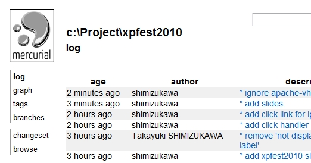
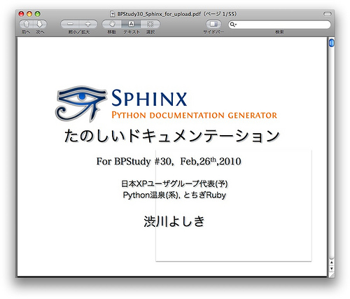
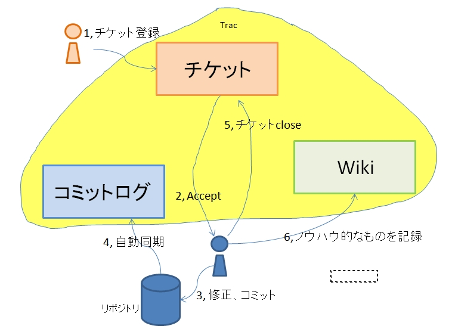
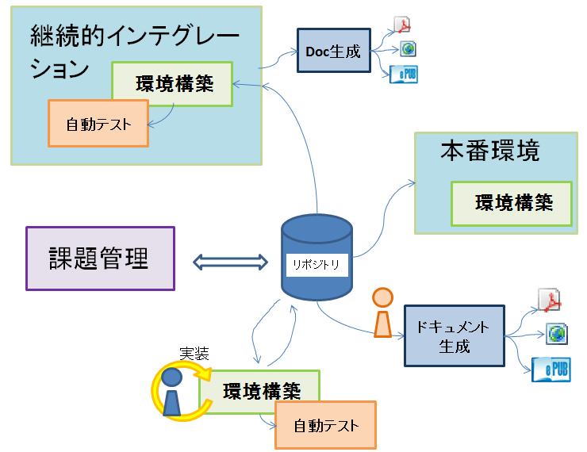
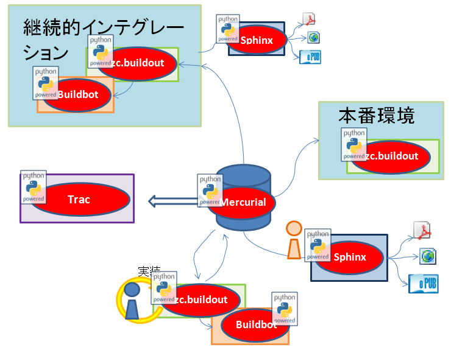

Pythonで アジャイル 開発サイクル 2010ver.
=========================================

.. :日時: 2010/9/4(土)
.. :話す人: 清水川 貴之
.. :時間: 50分

このコンテンツのコンテキスト
-----------------------------

  アジャイル開発をやっていると欲しくなる自動化ツール類を全て
  Python でそろえてみよう！

という **Engineering Practice** な **コンテキスト** で話をします。

.. raw:: html

    

そのまえに...
--------------

そのまえに...

.. raw:: html

    

自己紹介1: 清水川 貴之
-----------------------
* `http://清水川.jp/ <http://清水川.jp/>`_
  `@shimizukawa <http://twitter.com/shimizukawa>`_
* お仕事:
   * Python+Thrift+PHPによる認証サーバーとかCMSとか
* コミュ:
   * Zope/Plone系, Sphinx系, pyspa系, XP系
* 言語:
   * Python, Rails, 昔はC++/C/8086

.. .. figure:: meishi.jpg

.. figure:: sphinxusers.jpg

.. raw:: html

    

    

自己紹介2: 最近やってること
----------------------------
* Deliverance / xdv
   * Webフレームワークのテンプレを書き換えずにデザイン適用
   * 複数のフレームワークをまたがって同じデザインに

詳しくは `http://縮.jp/一点 <http://縮.jp/一点>`_ で！

.. .. todo::
..     * 5, 文字で説明してもわからん！絵を出せ
..     * 6, xdvトップページに画像で簡単なイメージを伝える

.. raw:: html

    

自己紹介3: 翻訳本を出しました
------------------------------
* エキスパートPythonプログラミング
   * アスキー・メディアワークス
   * B5変 (416ページ)
   * 3780円

.. figure:: epp.jpg

.. raw:: html

    

    

自己紹介3: 翻訳本を出しました.
------------------------------
エキPythonの概要

* 1章: 環境別インストール
* 2章: リスト内包表記, デコレータ
* 3章: メタクラス, デスクリプタ
* 4章: 良い名前を選ぶ
* 5,6章: アプリ作成とパッケージング
* 7章～11章: ずっとXP的な話
* 12～15章: 最適化,デザパタ,日本語

.. figure:: epp.jpg

.. raw:: html

    

自己紹介3: 翻訳本を出しました..
-------------------------------
エキPythonの概要

* 1章: 環境別インストール
* 2章: リスト内包表記, デコレータ
* 3章: メタクラス, デスクリプタ
* 4章: 良い名前を選ぶ
* 5,6章: アプリ作成とパッケージング
* 7章～11章: ずっとXP的な話
* 12～15章: 最適化,デザパタ,日本語

今日はこのへんの話をします。

.. figure:: epp.jpg

.. raw:: html

    

XPとワタシ
-------------
XPとの出会いは2002年頃、当時は組み込み開発へのxUnit適用と継続的インテグレーションを実践していました。2003年頃からZope, 2005年からPythonを使い始めましたが、それ以降もUnitTestや自動化といったことを続けています。

.. raw:: html

    

アジャイルに必要な自動化
--------------------------
**Engineering Practice**

* ソースコード管理の自動化
* テストの自動化
* 環境構築の自動化
* 継続的インテグレーションの実施
* ドキュメント生成の自動化

ソースコード管理の自動化
-------------------------

.. raw:: html

    

まずはソースコード管理から
---------------------------

何を自動化するにしても、まずはコード管理から！

* VCS (Version Controll System)
* ソースコード等の履歴を管理
* 全ての自動化の基盤

VCS: 中央集権 vs 分散
----------------------

* 中央集権と言えば: cvs, svn
* 分散と言えば: hg, bzr, git

中央集権と分散, どっちがいいの？

* サーバー不要でも使える **分散** が超おすすめ

VCS: 使ってみよう1
-------------------

* インストール
    * :command:`easy_install mercurial`
* 初期化
    * :command:`hg init`
* 複製
    * :command:`hg clone`

SCM: 使ってみよう2
-------------------

* 画面閲覧 & リポジトリ公開
    * :command:`hg serve -p 8000`

.. raw:: html

    

環境構築の自動化
------------------

.. raw:: html

    

環境構築って何？
-----------------
プログラムはVCSから入手するだけで動くものはほとんどありません。

* 関連プログラムの入手, 配置
* パスの設定, スクリプトの設置
* 環境設定ファイルの配置, 変更

環境構築の自動化
-----------------
.. Pythonのデファクトスタンダードとして :command:`easy_install` があります。

.. :command:`easy_install mercurial` のように1コマンドで済む場合もありますが、大抵、インストール後の手順がたくさん **手順書** に書かれているものと思います。

* **環境構築手順書** ってありますよね
* プログラムインストールから設定まで全く引っかからずに5分で出来ますか？
* buildout で自動化しましょう！

zc.buildout
------------

* buildout.cfg というini形式のファイルで全て自動化
* 右の例はZopeとPloneを自動インストールしてプラグインも入れます

.. code-block:: ini

    [buildout]
    parts = zope2 instance
    extends = http://dist.plone.org/release/3.3.4/versions.cfg
    versions = versions

    find-links =
        http://dist.plone.org/release/3.3.4
        http://download.zope.org/ppix/
        http://download.zope.org/distribution/
        http://effbot.org/downloads

    eggs =
        Plone
        Products.PloneFlashUpload
        Products.PloneSlimbox
        Products.ATGoogleMap

    [zope2]
    recipe = plone.recipe.zope2install
    fake-zope-eggs = true
    additional-fake-eggs = ZODB3
    url = ${versions:zope2-url}

    [instance]
    recipe = plone.recipe.zope2instance
    zope2-location = ${zope2:location}
    eggs = ${buildout:eggs}
    user = admin:admin
    http-address = 8080

.. raw:: html

    

zc.buildout の実行例
---------------------
.. code-block:: bash

    $ hg clone http://xxxxx/ .
    $ ls
    bootstrap.py   buildout.cfg
    $ python bootstrap.py
    $ bin/buildout

これでZope/Ploneのインストールと環境構築が完了しました！

zc.buildout デモ
-----------------

GAE環境を作ります。（デモ）

詳しくは `zc.buildout - Python Hack-a-thon 4: ハンズオン <http://www.freia.jp/taka/docs/pyhack4/buildout/>`_ を参照してください。

  あんちょこ :command:`python25 bootstrap.py init -d`

zc.buildoutで構築する環境の例
-------------------------------

* Zope/Plone のインストール、プラグイン設定、テスト環境
* Google App Engine の開発、テスト、デプロイ環境
* nginx, varnish のビルド、インストール、設定

テストの自動化
---------------

.. raw:: html

    

ユニットテスト
---------------

* Python標準のunittestライブラリ
* Nose や py.test などの高機能版
* PySpec (RSpecのpython版)
    * XP祭り実行委員長 @shibukawa 作

PythonのDocTest
----------------
* 機能の説明文章がそのままテストになるスグレモノ

PythonのDocTest.
------------------
.. code-block:: python

    def add(x, y):
        """ 二つの値を足します。

        >>> add(1, 2)
        3
        """
        return x + y

PythonのDocTest .
-----------------
* 機能の説明文章がそのままテストになるスグレモノ
* 実際にテストを動かしているところを見てみます

PythonのDocTest-2
------------------

.. raw:: html

    <object classid="clsid:D27CDB6E-AE6D-11cf-96B8-444553540000" codebase="http://download.macromedia.com/pub/shockwave/cabs/flash/swflash.cab#version=6,0,29,0" id=""> 
    <param name="movie" value="_static/20060521_doctest.swf"><param name="quality" value="high"><param name="menu" value="false"><param name="loop" value="1"><embed src="_static/20060521_doctest.swf"loop="1" quality="high" pluginspage="http://www.macromedia.com/go/getflashplayer" type="application/x-shockwave-flash" menu="false"></embed></object>

.. raw:: html

    

PythonのDocTest..
-----------------
* 機能の説明文章がそのままテストになるスグレモノ
* 実際にテストを動かしているところを見てみます
    * 続きは **DocTest TDD** で検索！

ここでおしらせです
--------------------
毎月勉強会などをやってます。

* `Sphinx+翻訳ハッカソン <http://atnd.org/events/7475>`_ (9/5)
* `エキPy読書会02 <http://atnd.org/events/6954>`_ (9/7)
* `Python mini Hack-a-thon <http://atnd.org/events/7474>`_ (9/25)

9月はほぼ埋まってしまいました><   10月もやりますよ！

.. raw:: html

    

    

継続的インテグレーションの実施
-------------------------------

.. raw:: html

    
    

継続的インテグレ―ション
-------------------------
自動テストサーバー Buildbot

.. figure:: buildbot-logo.png

.. raw:: html

    

Buildbotってなに？
-------------------

* 継続的インテグレーション
    - Pythonで書かれている
    - Pythonが動作する->Buildbot動作

* 類似ソフト
    - Hudson (http://hudson-ci.org/)
    - Tinderbox (http://www.mozilla.org/tinderbox.html)
    - CruiseControl (http://cruisecontrol.sourceforge.net/)

.. figure:: buildbot-logo.png

.. raw:: html

    

Buildbotってなに？
-------------------

* テスト自動化 (Python開発合宿2008冬)
  http://www.slideshare.net/shimizukawa/python-autotest-pdc2008w

.. figure:: buildbot-logo.png

.. raw:: html

    

buildbot on slideshare
-----------------------
.. raw:: html

    <object id="__sse5125068"><param name="movie" value="http://static.slidesharecdn.com/swf/ssplayer2.swf?doc=autotestpdc2008w-100903152901-phpapp02&stripped_title=python-autotest-pdc2008w" /><param name="allowFullScreen" value="true"/><param name="allowScriptAccess" value="always"/><embed name="__sse5125068" src="http://static.slidesharecdn.com/swf/ssplayer2.swf?doc=autotestpdc2008w-100903152901-phpapp02&stripped_title=python-autotest-pdc2008w" type="application/x-shockwave-flash" allowscriptaccess="always" allowfullscreen="true"></embed></object>

    

Buildbotを使っているツール類
-----------------------------
Buildbot, Python, Webkit, Mozilla, Google Chromium XEmacs, MongoDB, Wireshark
ILM, Boost, Zope, Twisted, SpamAssassin, OpenID, KDE, GHC, Subversion, OpenOffice, Jython ...

http://buildbot.net/trac/wiki/SuccessStories

.. figure:: buildbot-logo.png

.. raw:: html

    

ドキュメント生成の自動化
-------------------------

.. raw:: html

    

ドキュメンテーション-- --
--------------------------

ドキュメント作成はさぼってしまいがち

* 開発終了に向かうにつれて時間がない
* 自分は文章を書くのが苦手だ
* 誰も見ない文章は書きたくない

こういった状況から・・・

ドキュメンテーション++
-----------------------

ドキュメントを書くのは楽しい！へ

* プロジェクト開始時にプロセスを整備
* 必要な文章を必要な時に書く
* ソフトウェアコード同様に成長させていく

ドキュメントを書くのをもっと簡単に！

Sphinxとは何か？
-----------------

* ドキュメント生成のツール
* reStructuredText記法(Wikiっぽい?
* ページ間のリンクを自動生成
* 強力なコードハイライト
* HTML, PDF, ePub, htmlhelp, latex, man...

.. raw:: html

    

Sphinxの記入の例
------------------

.. code-block:: rst

    Sphinxのサンプル
    =================

    Sphinxとは何か？
    -----------------
    * ドキュメント生成のツール
    * reStructuredText記法(Wikiっぽい?
    * ページ間のリンクを自動生成
    * 強力なコードハイライト
    * HTML, PDF, ePub, htmlhelp, latex, man...

.. figure:: sphinx-sample.jpg

.. raw:: html

    

ここでちょっと...
---------------------

良い資料があるので紹介します。

* `渋日記: Sphinx紹介セッション@BPStudy #30 <http://blog.shibu.jp/article/35729439.html>`_

.. raw:: html

    

もうひとつ。
-------------

.. raw:: html

    

課題管理システム
------------------
PythonだとTracが有名ですね。

* Trac = Wiki + 課題管理 + コード管理

Tracを使う流れ
---------------

.. raw:: html

    

Tracを使う流れ.
----------------

* チケット(課題)を登録
    * -> #id が決まる(10とか)
* 課題の実装・テストしてコミット
    * -> コミットログに #10 と記載
* チケットに完了リビジョンを記載
    * -> チケットとコミットが関連付け

.. raw:: html

    

最後に
------

.. raw:: html

    

全てをひとつに繋ぐ
-------------------

* ソースコード管理の自動化
* テストの自動化
* 環境構築の自動化
* 継続的インテグレーションの実施
* ドキュメント生成の自動化

全てをひとつに繋ぐ.
-------------------

.. raw:: html

    

全てをPythonで。
----------------

.. raw:: html

    

質問タイム？
-------------

.. raw:: html

    

おまけ
-------
今日のプレゼンテーションは

* Sphinx
* S6 (c) 2007 Cybozu Labs, Inc.

で作成しました。

まとめ
-------

MercurialHG, Bazaar, PyPI, setuptools, easzy_install, zc.buildout, Paver, Nose, py.test, Buildbot, Trac, Sphinx, ...

* 続きは懇親会、または勉強会で！

ご清聴ありがとうございました

